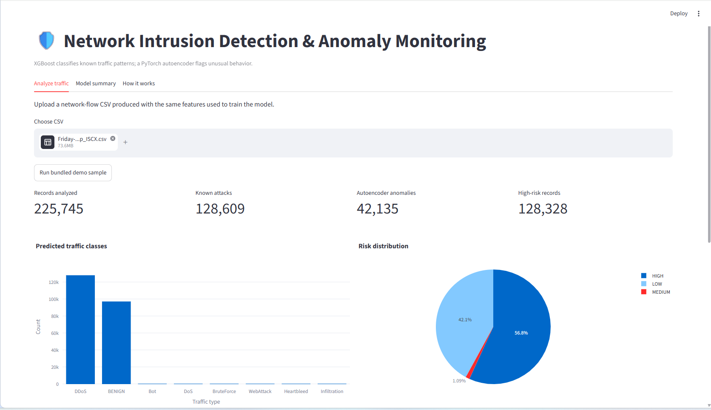
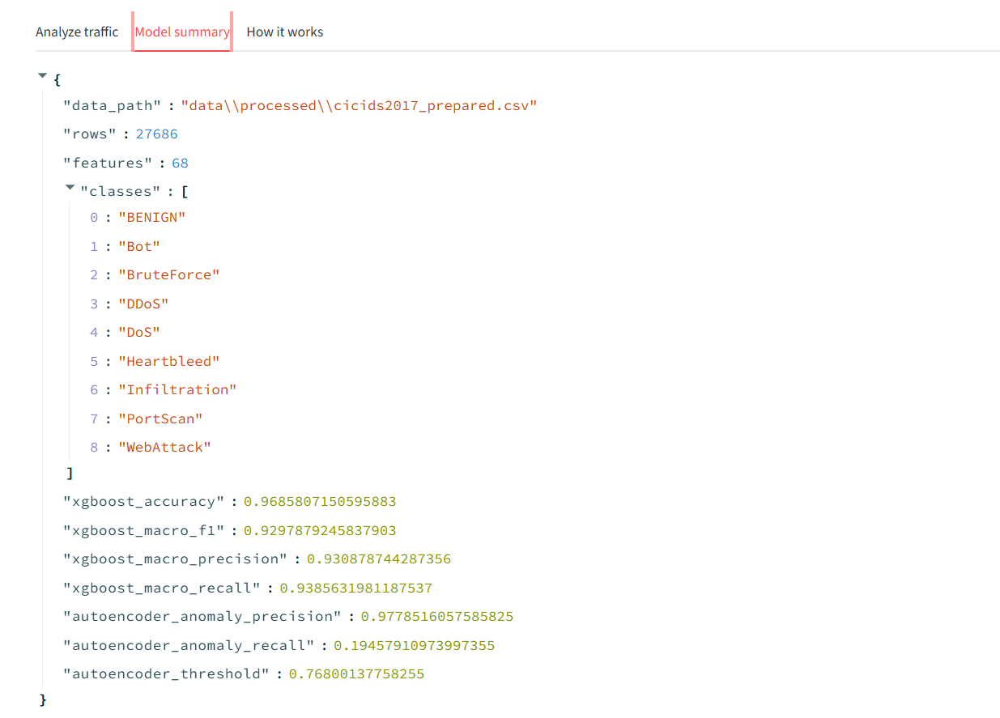

# Network Intrusion Detection & Anomaly Monitoring System

A network security application for detecting malicious traffic and unusual network behavior from network-flow data.

The system combines an **XGBoost multi-class classifier** for identifying known attack patterns with a **PyTorch Autoencoder** for detecting traffic that differs from learned benign behavior. Results are presented through an interactive **Streamlit dashboard** with traffic-class distributions, anomaly scores, and risk levels.

---

## Overview

Traditional intrusion detection systems often rely on known attack signatures. This project uses two complementary approaches:

- **XGBoost** classifies traffic into known network attack categories.
- **Autoencoder-based anomaly detection** identifies unusual traffic patterns based on reconstruction error.
- A combined risk layer assigns **LOW, MEDIUM, or HIGH** risk levels.
- A Streamlit dashboard allows CSV-based traffic analysis and visualizes the results.

The project was evaluated using the **CIC-IDS2017** network intrusion detection dataset.

---

## System Workflow

```text
Network Flow CSV
       |
       v
Data Cleaning & Feature Processing
       |
       +-----------------------+
       |                       |
       v                       v
    XGBoost              Autoencoder
       |                       |
Known Attack              Anomaly Score
Classification                 |
       |                       |
       +-----------+-----------+
                   |
                   v
              Risk Analysis
                   |
                   v
          Streamlit Dashboard
```

---

## Features

- Multi-class network attack classification
- Anomaly detection using a neural-network autoencoder
- Analysis of CIC-IDS2017 network-flow CSV files
- Automatic preprocessing of numerical traffic features
- LOW / MEDIUM / HIGH risk assignment
- Attack distribution visualization
- Anomaly-score monitoring
- CSV upload and analysis through Streamlit
- Exportable prediction results

---

## Detected Traffic Classes

The preprocessing pipeline groups CIC-IDS2017 labels into the following broader classes:

- BENIGN
- Bot
- BruteForce
- DDoS
- DoS
- Heartbleed
- Infiltration
- PortScan
- WebAttack

Only classes available in the processed dataset are used during training.

---

## Model Performance

The final model was trained on prepared **CIC-IDS2017** network-flow data.

| Metric | Result |
|---|---:|
| Processed records | 27,686 |
| Numerical features | 68 |
| Traffic classes | 9 |
| XGBoost Accuracy | **96.86%** |
| XGBoost Macro F1 | **92.98%** |
| XGBoost Macro Precision | **93.09%** |
| XGBoost Macro Recall | **93.86%** |
| Autoencoder Anomaly Precision | **97.79%** |
| Autoencoder Anomaly Recall | **19.46%** |

The XGBoost classifier performs the primary known-attack classification. The autoencoder is used as an additional anomaly signal and is intentionally more conservative at the current threshold.

---

## Project Demo

### Network Traffic Analysis Dashboard



The dashboard above shows analysis of CIC-IDS2017 DDoS traffic, including predicted traffic classes, anomaly detection, and overall risk distribution.

### Model Summary



The model summary displays the training configuration and evaluation results obtained from the processed CIC-IDS2017 dataset.

---

## Example Analysis

A CIC-IDS2017 DDoS traffic CSV containing **225,745 network-flow records** was analyzed through the dashboard.

The system identified:

- **128,609** records as known attacks
- **42,135** records as autoencoder anomalies
- **128,328** records as high-risk traffic

The traffic distribution was dominated by **DDoS** and **BENIGN** flows, which is consistent with an attack-day capture containing both malicious and legitimate traffic.

---

## Technologies Used

- **Python**
- **XGBoost**
- **PyTorch**
- **Scikit-learn**
- **Pandas**
- **NumPy**
- **Streamlit**
- **Plotly**
- **Joblib**

---

## Dataset

This project uses the **CIC-IDS2017** dataset developed by the Canadian Institute for Cybersecurity at the University of New Brunswick.

Dataset page:

https://www.unb.ca/cic/datasets/ids-2017.html

For this project, download the:

```text
MachineLearningCSV.zip
```

Extract the CSV files and place them inside:

```text
data/raw/
```

The raw dataset is intentionally not included in this repository because of its size.

---

## Project Structure

```text
network_intrusion_project/
│
├── app.py
├── config.py
├── requirements.txt
│
├── setup_windows.bat
├── run_dashboard.bat
├── run_demo.bat
├── train_real_cicids.bat
├── repair_and_train.bat
│
├── data/
│   ├── raw/
│   │   └── README.md
│   ├── processed/
│   └── demo/
│
├── models/
│   ├── autoencoder.pt
│   ├── xgboost_classifier.joblib
│   ├── scaler.joblib
│   ├── label_encoder.joblib
│   ├── feature_columns.json
│   └── anomaly_threshold.json
│
├── reports/
│
├── Screenshots/
│   ├── ddos_analysis_dashboard.png
│   └── model_summary.png
│
└── src/
    ├── common.py
    ├── generate_demo_data.py
    ├── prepare_cicids2017.py
    ├── train_all.py
    ├── inference.py
    └── predict_csv.py
```

---

## Installation

### 1. Clone the repository

```bash
git clone https://github.com/ManikaR26/network-intrusion-detection.git
cd network-intrusion-detection
```

### 2. Create a virtual environment

On Windows:

```bat
py -3.11 -m venv .venv
.venv\Scripts\activate
```

### 3. Install dependencies

```bat
pip install -r requirements.txt
```

Alternatively, Windows users can run:

```text
setup_windows.bat
```

---

## Training on CIC-IDS2017

After downloading and extracting `MachineLearningCSV.zip`, place the CSV files inside:

```text
data/raw/
```

The files may also remain inside a subfolder under `data/raw/`; the preparation script searches recursively.

Then run:

```text
train_real_cicids.bat
```

The training pipeline performs:

1. CIC-IDS2017 CSV discovery
2. Label normalization
3. Data cleaning
4. Numerical feature selection
5. Class balancing
6. XGBoost training
7. Autoencoder training on BENIGN traffic
8. Model evaluation
9. Model and report saving
10. Streamlit dashboard startup

---

## Manual Training

The same process can be run manually:

```bat
python -m src.prepare_cicids2017 --input-dir data\raw --max-per-class 5000
```

Then:

```bat
python -m src.train_all --data data\processed\cicids2017_prepared.csv --epochs 20
```

Start the dashboard:

```bat
streamlit run app.py
```

The application will normally be available at:

```text
http://localhost:8501
```

---

## Using the Dashboard

Open the **Analyze traffic** tab and upload a compatible network-flow CSV.

The application:

1. reads the uploaded traffic,
2. aligns the required model features,
3. runs XGBoost classification,
4. calculates the autoencoder reconstruction error,
5. flags anomalous records,
6. assigns a risk level,
7. displays traffic and risk distributions.

The dashboard also provides record-level information such as:

- predicted class,
- classifier confidence,
- anomaly score,
- anomaly flag,
- risk level.

---

## Command-Line Prediction

A CSV can also be analyzed without the dashboard:

```bat
python -m src.predict_csv data\demo\upload_sample.csv
```

Predictions are written to:

```text
reports/predictions.csv
```

---

## Models

### XGBoost Classifier

XGBoost is used for supervised multi-class classification because CIC-IDS2017 provides labelled network-flow features.

The classifier learns patterns associated with known traffic classes such as DDoS, DoS, PortScan, Bot, and BruteForce.

### Autoencoder

The autoencoder is trained using **BENIGN traffic only**.

It learns to reconstruct normal network behavior. During inference, traffic producing a reconstruction error above the learned threshold is marked as anomalous.

This provides an additional signal that does not depend directly on the XGBoost attack label.

---

## Limitations

- The current implementation analyzes pre-generated network-flow CSV files rather than capturing live packets.
- Autoencoder anomaly recall is relatively low with the current threshold and can be improved through threshold tuning and architecture experimentation.
- Results depend on the distribution and preprocessing of CIC-IDS2017 data.
- The system should be treated as an experimental intrusion-detection pipeline rather than a production security product.

---

## Future Improvements

Possible extensions include:

- real-time packet or flow ingestion,
- live alert generation,
- improved anomaly-threshold calibration,
- feature-importance visualization,
- additional intrusion-detection datasets,
- automated model comparison,
- REST API integration,
- deployment of the Streamlit dashboard.

---

## References

- CIC-IDS2017 Dataset  
  https://www.unb.ca/cic/datasets/ids-2017.html

- XGBoost  
  https://xgboost.readthedocs.io/

- PyTorch  
  https://pytorch.org/

- Streamlit  
  https://streamlit.io/
